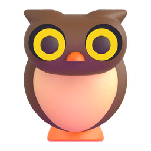
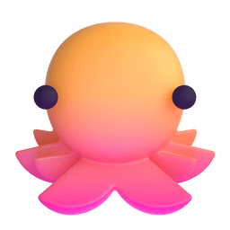
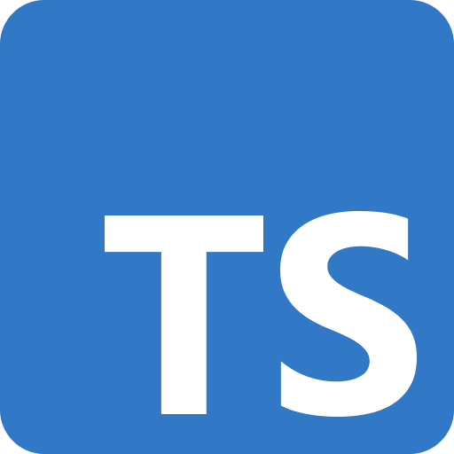
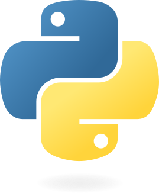
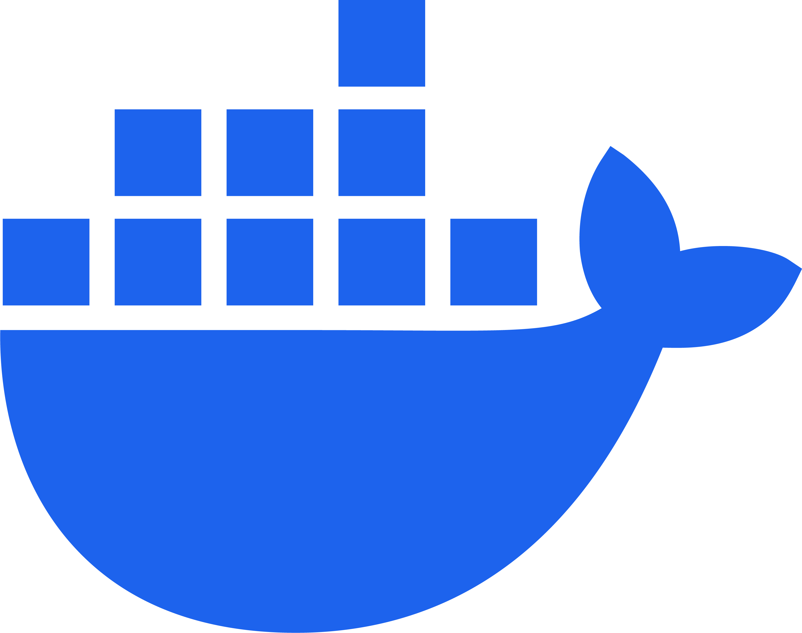
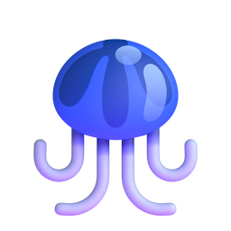
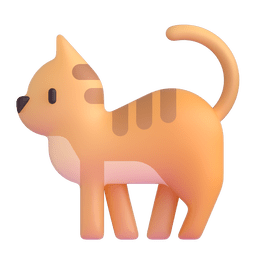
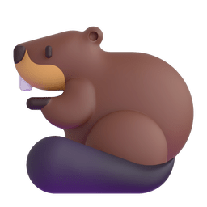

     
    
    

  <b>Léo</b>, french software engineer <i>since September 2024</i>. 

I like pasta and web technologies.
I work with <a href="https://www.typescriptlang.org/">  TypeScript </a>, <a href="https://www.python.org/">  Python </a>  and <a href="https://www.docker.com/">  Docker </a> on a regular basis.

Any questions ? send me an [email](leofiloche.wk@gmail.com) or a message on [LinkedIn](https://www.linkedin.com/in/leofiloche/).

     
    
    

